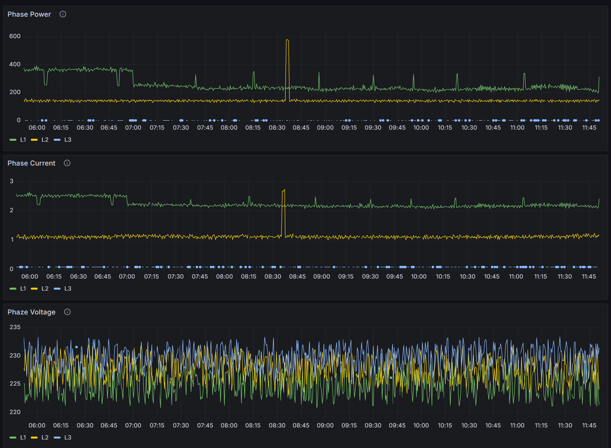

# Умный трехфазный энергомонитор на ESP32 и PZEM-004T

Проект для мониторинга трехфазного электропотребления с интеграцией в Home Assistant через ESPHome.

## Особенности
- 📊 Мониторинг параметров по всем трем фазам:
  - Напряжение (V)
  - Ток (A)
  - Активная мощность (W)
  - Частота (Hz)
  - Коэффициент мощности
  - Потребленная энергия (kWh)
- 🚨 Дополнительные бинарные датчики:
  - Статус основного питания
  - Состояние дверцы электрощитка
  - Сигнализация периметра
- 🔄 Автоматическая перезагрузка устройства через интерфейс
- 🌐 Веб-интерфейс для мониторинга (порт 80)
- 📶 OTA-обновления прошивки

## Поддерживаемое оборудование
- Микроконтроллер: ESP32 (тестировалось на ESP32-DevKitC)
- Датчики: 3 × PZEM-004T v3.0
- Дополнительно: Кнопки/герконы для бинарных датчиков

## Установка и настройка

1. Скопируйте конфигурационный файл в папку `esphome`
2. Настройте параметры в секциях:
   - `wifi` - параметры вашей сети
   - `ota` - пароль для OTA-обновлений
   - `api` - при необходимости настройте шифрование
3. Прошейте устройство через USB или OTA
4. Убедитесь в правильности подключения:
Фаза A: TX=GPIO19, RX=GPIO18
Фаза B: TX=GPIO17, RX=GPIO16
Фаза C: TX=GPIO1, RX=GPIO3

Бинарные датчики:

Main Power: GPIO23

PowerBox Door: GPIO22

Perimeter: GPIO21

## Интеграция с Home Assistant
После успешной настройки в HA автоматически появятся:
- 18 сенсоров энергии (по 6 на каждую фазу)
- 4 бинарных датчика
- Кнопка перезагрузки устройства

Пример использования в автоматизациях:
```yaml
automation:
- trigger:
   platform: state
   entity_id: binary_sensor.power_box_door
   to: "on"
 action:
   service: notify.mobile_app
   data:
     message: "Внимание! Дверца электрощита открыта!"
```
Кастомизация
Измените интервал опроса датчиков (параметр update_interval)

Добавьте дополнительные датчики температуры/влажности

Настройте фильтры для бинарных датчиков

Измените параметры fallback точки доступа

Схема подключения
plaintext
Copy
PZEM-004T (Фаза A)   ESP32
     TX          →  GPIO19
     RX          ←  GPIO18

PZEM-004T (Фаза B)   ESP32
     TX          →  GPIO17
     RX          ←  GPIO16

PZEM-004T (Фаза C)   ESP32
     TX          →  GPIO1
     RX          ←  GPIO3

Бинарные датчики:
Main Power      → GPIO23 (подтяжка к +3.3V)
PowerBox Door   → GPIO22 (подтяжка к +3.3V)
Perimeter Alarm → GPIO21 (подтяжка к +3.3V)
Безопасность
Все работы с высоким напряжением выполняйте при отключенном питании

Используйте разделительные трансформаторы при отладке

Обеспечьте надежную изоляцию всех соединений

## Визуализация в Grafana 📊
В проекте доступен готовый дашборд для Grafana (`Grafana.json`), который включает:
- Панели мониторинга мощности по фазам (Phase Power)
- Панели мониторинга тока по фазам (Phase Current)
- Панели мониторинга напряжения по фазам (Phase Voltage)



### Особенности дашборда:
- Автоматическое обновление данных
- Временной диапазон: последние 6 часов
- Поддержка InfluxDB как источника данных

### Установка дашборда:
1. В Grafana перейдите в раздел Dashboards → Import
2. Загрузите файл `Grafana.json`
3. Укажите UID источника данных InfluxDB: "1n5SWy57k"

### Имена сущностей в Home Assistant:
- Мощность: phaze_a_power, phaze_b_power, phaze_c_power
- Ток: phaze_a_current, phaze_b_current, phaze_c_current
- Напряжение: phaze_a_voltage, phaze_b_voltage, phaze_c_voltage

Лицензия
MIT License. Полный текст доступен в файле LICENSE.
